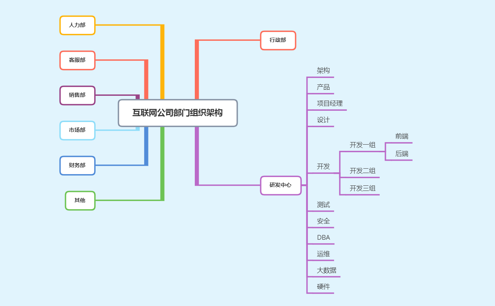
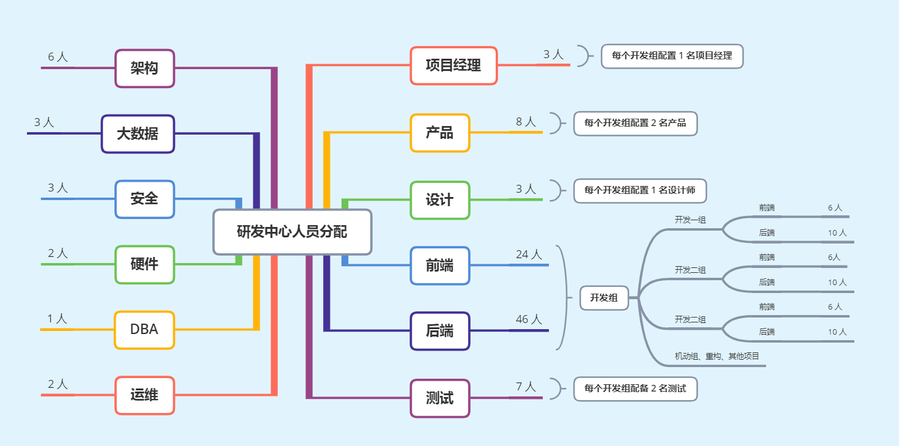

### 公司人员分配

---

#### 1. 本篇内容概述：


◇   熟悉互联网公司部门组织架构

◇   了解开发岗位人员的分配比例


#### 2. 前言

​		很多同学刚毕业，没有在互联网公司入过职，还有部门同学是从其他行业转岗而来，对公司的部门组织架构以及研发部分的人员分配情况不是很熟悉，为了让同学们在入职之后，能够更快的适应公司的环境，在这里，我将上家公司得到组织架构以及研发部门的情况列举出来，供大家进行参考。所以在这一节中，主要介绍两个部分：

1.  互联网公司部门组织架构
2.  前后端与其他人员分配情况


注意：这部分只做一个参考，帮助同学们熟悉公司环境，但公司的实际情况需要结合公司的行业、规模等等情况进行区别看待。根据行业、规模的不同，每家公司的部门组织架构以及人员配比，也不尽相同。


#### 3. 互联网公司部门组织架构

​		首先先介绍下公司部门组织架构，详细的可以看下图。与我们息息相关便是研发中心部门，也是我们自己的一亩三分地，其中产品、设计、测试等在实际的开发中也是主要将打交道的岗位，需要与这些岗位紧密的配合、相互协调，才能够将公司产品进行高质量的产出。

​		研发中心我们在下面会进行详细的讲解，现在需要我们知道的就是公司中的组织架构体系。

​		其他部门，我们通过字面意思差不多就能够了解具体的职责，在这里我们不做详细的解释，感兴趣的同学，可以利用开发神器 “ 百度大法 ” ，去进行了解。




#### 4. 前后端与其他人员分配情况



​		

一图胜千言，具体的人员配置情况如上图，在这里，我列举出前后端与其他人员分配情况。右侧的岗位贯穿整个开发的过程，例如：产品经理产出了需求、设计进行了设计稿的设计、前端后端协调开发将项目完工、测试岗位将项目进行测试，运维部门搭建了自动部署环境，项目经理在整个过程中制定项目计划，推进项目进度，最终将项目进行了上线。

​		关于每个岗位具体的职能，在开发中的工作内容，在后续章节中会进行详细的讲解，在这里，我们主要关注的是开发组的人员分配情况：

1. 首先前端与后端基本是  1 ： 2 的情况，即 1 个前端 对应两个后台，这个原因主要因为公司采用的前后端分类的开发模式，后端承担了大部门的业务逻辑，前端只需要使用后台提供的数据进行渲染，所以后端工作量大于前端。

 	2.   一个开发组，即是一个业务线，每个线配置 1 名项目经理
 	3.   一个业务线， 配置 1 名设计师，
 	4.   一个业务线，配置 2 名测试人员，小程序端一名、PC 端一名
 	5.   一个业务线，配置 2 名产品经理，产品经理会提前规划、产出一个月左右的需求计划


【**注意**】

1. **所有的人员分配并不是固定的，各组之间会进行互借互调用**，也就是说遇到其他开发组的业务、开发任务重时，是可以从其他组借调人员辅助完成其他组开发。

 	2.  **并不是每家公司的人员分配情况都是这种分配情况**，具体情况具体分析哟，面试的时候也可以具体回答哟，例如：我待过的其他几家公司
     - a 公司，社群电商， 2 名前端， 4 名 `java`，3 名设计， 2 名 `IOS`，2 名 `Android`， 1 名架构师 等
     - b 公司，创业公司， 1 名前端，1 名 `PHP`，1 名设计，1  个老板，1 个联合创始人


​		`ok` ！ 到这里，我们就已经把公司的人员架构以及公司人员的分配比例给讲解完成了，这两个内容，在面试的时候，有时候 `HR` 会问到，大家可以结合具体的情况进行回答即可 。


​		下面咱们准备了一个小的拓展，大家可以自己看下。


#### 5.  拓展阿里、百度岗位级别与薪酬范围

##### 5.1 百度


###### 5.1.1 岗位级别


```html
1. 占比最大的是 T4、T5，占比最小的是 T8 以上占比都是比较少

2. T5 是级别的分水岭，T5 晋升到 T6 是一个坎，有一定难度，T6 再往上晋升会更难。T7 以上一般就不做 coding 了
```


###### 5.1.2 薪酬范围


```html
1. 年薪 = 月薪 × 14.6（12+0.6+2）

2. T5 以上为关键岗位，另外有股票、期权

3. 入职后，工资每年有一次普涨的机会，在第一季度的三月调整，四月公布。一般来说，普涨的幅度在 15%
```


##### 5.2 阿里


###### 5.2.1 岗位级别


```html
1. P 与 M 有相关对应关系：P6 相当于 M1，P7 相当于 M2，P8 相当于 M3，P9 相当于 M4，P10 相当于 M5，以此类推。

2. 阿里的非管理岗（技术岗 P 级别）分为 10 级；其中 P6-资深工程师、P7-技术专家、P8-高级专家的需求量最大，也是阿里占比最大的级别中段。

3. P7 是级别的分水岭，P6 晋升到 P7 是一个坎，有一定难度，P7 再往上晋升会更难。
```


###### 5.1.2 薪酬范围


```html
1. 年薪 = 月薪 ×16（12+1+3）

2. 职位达到公司中层水平才能拿股票，而 P6（M1）以上才属于中层。股票是工作满 2 年才能开始拿，满两年可以拿 50％，第 3 年 25%，第 4 年 25%，4 年拿完。

3. P4 以下、P10 以上没有具体数据。

4. 年终奖不与工资挂钩，而是根据员工对公司的贡献分配，它由所属子公司、部门、以及员工个人的绩效所决定，一般是 0-6 个月薪资，90%人可拿到 3 个月。
```

