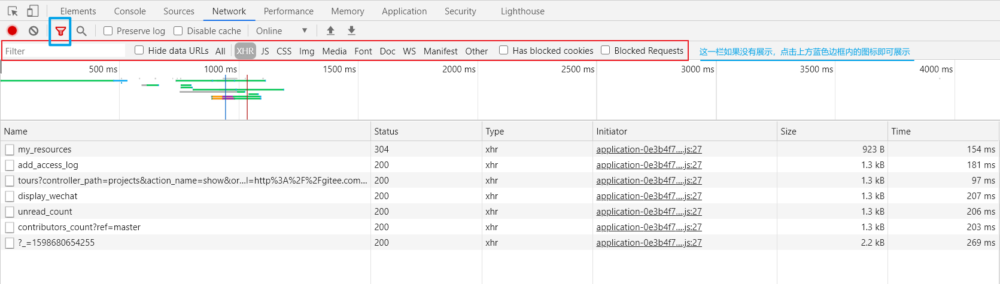
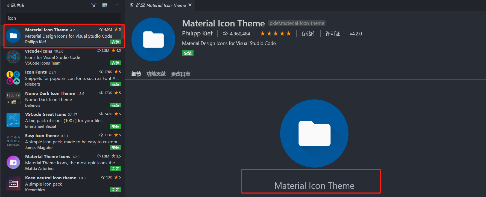
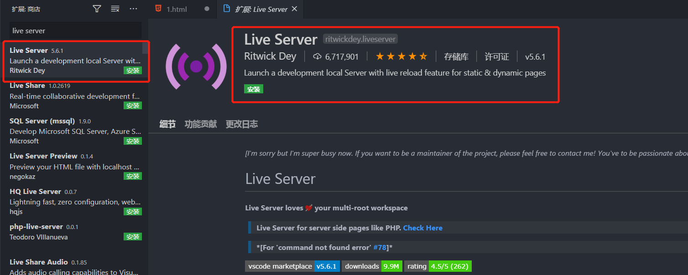
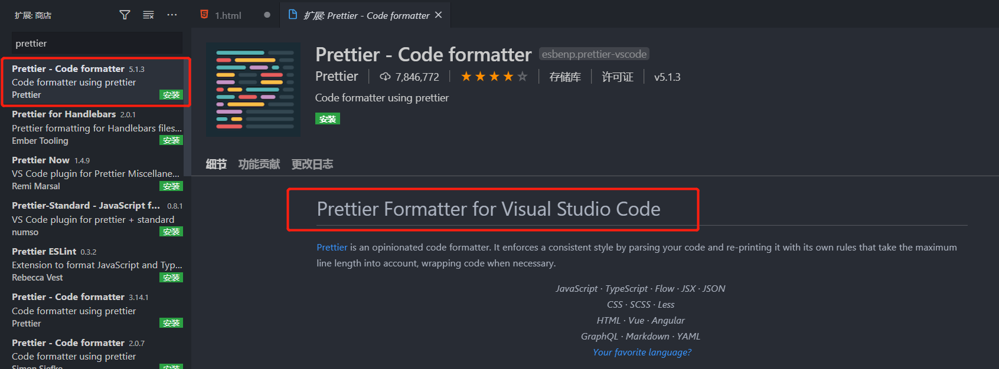
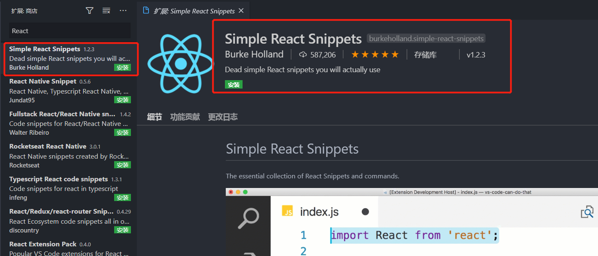
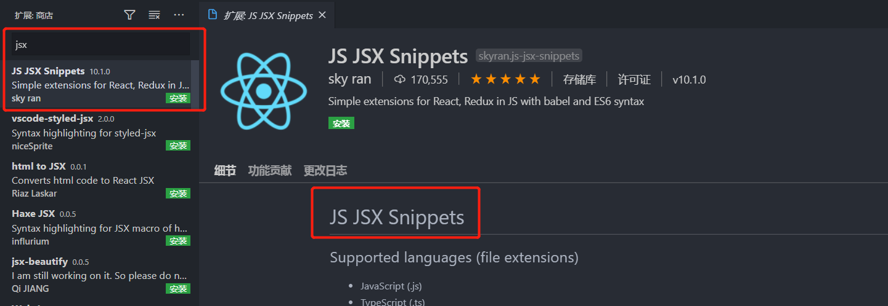
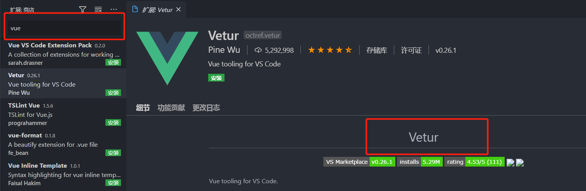
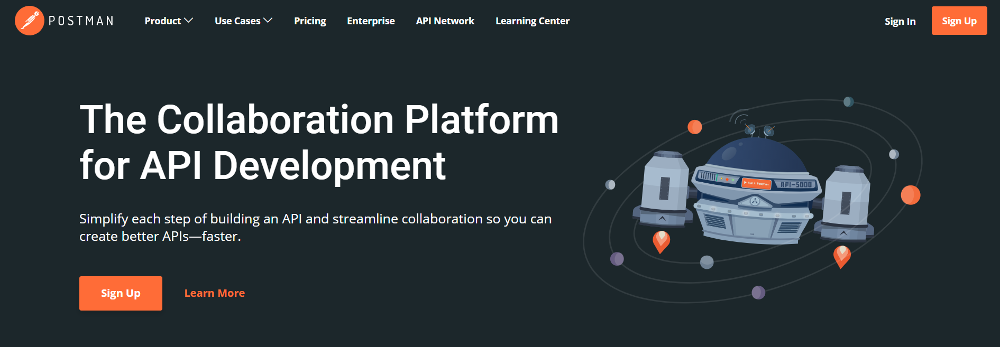

#### 开发环境的搭建

---


#### 1. 本篇文章概述：

◇  新电脑如何配置开发环境

◇  新电脑应该安装那些工具

◇   chrome 的安装以及设置小技巧

◇    Vscode  相关配置

◇   Git   相关配置

◇   Node 和 npm 的配置

◇   脚手架工具的安装

◇    postman 工具的安装

◇    脚手架工具的安装

◇    其他推荐


#### 2.  前言

​		在正式入职或者在日常重装系统以后，如果公司给配置了新的电脑。都需要对开发环境重新搭建，搭建环境的过程是非常痛苦的，因为不知道哪些东西需要是必须安装，必须配置的，也会造成一些插件或者包的遗漏安装，这也成为很多新手程序员的烦恼。下面给提供一份开发环境的基础配置清单，这份清单中囊括了笔者在面试新电脑时基础的配置，你可以在这份清单中继续添加日常开发中安装的一些插件、工具等，这样在以后面对新电脑，就可以按照清单进行配置。


#### 3. 配置清单

##### 3.1 chrome 的安装以及设置小技巧

> [chrome 下载地址](https://www.google.cn/chrome/)，安装方式下一步下一步


###### 1.1 设置默认搜索

> 设置后，在地址栏输入需要搜索的内容，即可立即搜索


1.  点击设置

   

   

2.  将默认的搜索设置为百度

   


###### 1.2 筛选静态资源





##### 3.2 Vscode 下载安装以及常用的插件

> [Vscode 下载地址](https://code.visualstudio.com/)


###### 3.2.1 中文语言插件

1. 搜索 `chinese` 

2. 点击中文简体，下载即可

   

   


###### 3.2.2 主题

> 一个赏心悦目的主题能够保护自己眼睛，也能给自己带来写代码的舒适感

1.  这里下载了我比较喜欢的 `Atom` 主题，当然你也安装自己喜欢的主题哟

2.  搜索 `Atom`，第一个就是

3. 点击安装

   

   


###### 3.2.3 文件图标主题

> 能够让你快速识别出文件的类型

1. 搜索 `icon` 

2. 找到自己比较喜欢的图标主题，下载安装即可

   

   

   

3.  设置主题

   

   

   

4.  在弹出的框架，启动自己安装的主题即可

   

   


###### 3.2.4 源代码管理插件GitLens

> 在多人协作开发过程中，能够看到开发的日志，提高开发效率

1. 搜索 `GitLens`

2. 点击安装

   

   


###### 3.2.5 Live Server

> 能够开启一个本地服务器，更好的实时预览开发的项目

1. 搜索 `Live Server`

2.  下载安装

   

   

 

###### 3.2.6 Prettier - Code formatter

> 帮助开发者格式化代码，并提供颜色关键字以使代码更具可读性

1. 搜索 `Prettier - Code formatter`

2.  下载安装

   

   


###### 3.2.7  Simple React Snippets

> 如果需要开发 React ，可以安装这个插件

1. 下载 `Simple React Snippets`

2.  安装下载

   

   


###### 3.2.8 JS JSX Snippets

> 如果需要开发 React ，可以安装这个插件

1. 搜索 `JS JSX Snippets`

2. 安装下载

   

   


###### 3.2.9  `Vetur`

> `Vue` 开发利器

1. 搜索 `Vetur`

2. 安装下载

   


###### 3.2.10 设置 注释、变量等颜色

> 按需定制注释、变量

1. 点击左下角设置

2. 搜索 `setting.json` 文件

3. 拷贝下面代码设置即可

   ```json
   "editor.tokenColorCustomizations": {
       "comments": {
           // 设置字体样式 加粗 下划线 斜体等
           "fontStyle": "",
           // 设置字体颜色
           "foreground": "#4CAEE2"
       }, // 注释
       "keywords": "#0a0", // 关键字
       "variables": "#f00", // 变量名
       "strings": "#e2d75dbd", // 字符串
       "functions": "#5b99fcc9", // 函数名
       "numbers": "#AE81FF" // 数字
   }
   ```


##### 3.3  Git 下载安装以及配置

> [Git 下载地址](https://git-scm.com/)


###### 3.3.1 全局用户名和邮箱配置

1. 配置全局邮箱

   ```shell
   git config --global user.email "你的邮箱"
   ```

   

2. 配置全局用户名

   ```shell
   git config --global user.name "wang"
   ```

   

###### 3.3.2 ssh 配置

1. 在 `Git Bash Here` 终端中输入 `ssh-keygen` 后根据提示，按三次回车即可

   ```shell
   ssh-keygen
   ```

   

2. 复制公钥内容

   - 所在地址

   ```js
   // C:\Users\你的电脑用户名\.ssh\id_rsa.pub
   ```

   

3. 拷贝内容，到 `github` 、`码云`、`gitlab` 等托管平台中，找到设置，将拷贝的公钥内容，粘贴即可


##### 3.4  Node 以及 npm 的下载设置

> [Node 下载地址](http://nodejs.cn/download/)
>
> node 版本不要低于 10 ，20210519 


###### 3.4.1 cnpm

1.  安装方式1：

   ```shell
   npm i cnpm -g
   ```

   

2.  安装方式2：

   ```shell
   # 如果你没有配置淘宝镜像可以参数传入加速
   npm install -g cnpm --registry=https://registry.npm.taobao.org
   ```

   

###### 3.4.2 yarn

1.  安装方式1：

   ```shell
   npm i yarn -g
   ```

   

2. 安装方式2：

   ```shell
   cnpm i yarn -g
   ```

   

###### 3.4.3 nrm

1.  安装

   ```shell
   cnpm install -g nrm
   ```

   

2.  显示 `nrm` 可用镜像源

   ```shell
   C:\Users\WebSec>nrm ls
   
   * npm -------- https://registry.npmjs.org/
     yarn ------- https://registry.yarnpkg.com/
     cnpm ------- http://r.cnpmjs.org/
     taobao ----- https://registry.npm.taobao.org/
     nj --------- https://registry.nodejitsu.com/
     npmMirror -- https://skimdb.npmjs.com/registry/
     edunpm ----- http://registry.enpmjs.org/
   ```

   

3.  切换镜像源

   ```shell
   nrm user xxx
   ```

   

###### 3.4.4 nodemon

1. 安装

   ```shell
   cnpm i nodemon -g
   ```

   

2. 执行 `node` 脚本

   ```js
   nodemon xxx.js
   ```

   


##### 3.5 脚手架工具的下载


###### 3.5.1 vue-cli 安装

> [详见官网](https://cli.vuejs.org/zh/guide/installation.html])


###### 3.5.2 create-app-react 安装

> [详见官网](https://create-react-app.dev/docs/getting-started/)


##### 3.6 postman 安装与下载

> [下载地址](https://www.postman.com/downloads/)


1. 先进行下载




2.  安装好以后，进入 postman 界面

   

   

3.   进入界面

   


##### 3.7 其他开发者工具安装

> 根据自己的项目需要，按需进行安装

1.  微信开发者工具
2.  支付宝开发者工具
3.  `HBuilder`
4.  .... 等


#### 4. 其他小工具安装

1.  `everything`
   
   - 基于名称快速定位文件和文件夹
   
2.  `notepad++`
   
   - 一个免费的代码编辑器，常用语代码审计与审查
   
3.  `teamviewer`

   - 或者向日葵

   - 随时随地连接到远程桌面电脑

4.  `ToDoList`

   - 管理、计划和合作任务及项目

5.  好压
    - 压缩工具


#### 5. 总结：

​		在这一步，我们已经将常用的软件、插件、或者日常开发中的工具安装完毕，开始熟悉新电脑进行开发吧。

​		切记哟：不要忘记把自己常用的插件、软件、工具添加到清单中，方便以后的配置。


